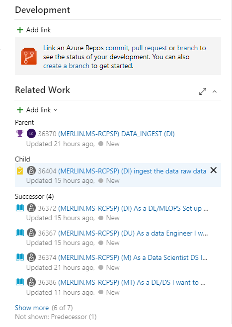
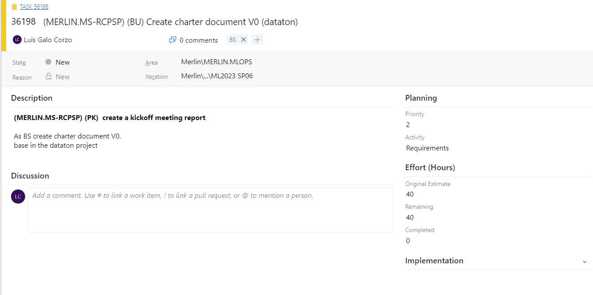

# Dataton BAIC

$$
$\color{red}{IMPORTANT}
$$

| Version | name            | Release Date  | Description     |
| ------- | --------------- | ------------- | --------------- |
| 1.0     | Luis Galo Corzo | April 4, 2023 | Initial release |

<!-- PULL_REQUESTS_TABLE -->

<!-- cspell:ignore Galo Corzo Dataton BAIC PSPLIB Kanban Asana -->

<!-- cspell:ignore Gantt RCPSP ipynb Scikit -->

<!-- cspell:disable -->

- [Introduction](#introduction)
  - [Agile Project Management](#agile-project-management)
  - [EPICS](#epics)
  - [Features](#features)
  - [User Stories](#user-stories)
  - [Tasks](#tasks)
  - [Sprint/iteration](#sprintiteration)
  - [Resources/Roles](#resourcesroles)
  - [Agile Project Management Tools](#agile-project-management-tools)
- [Resource-Constrained Project Scheduling Problem (RCPSP)](#resource-constrained-project-scheduling-problem-rcpsp)
- [Agile Project Management and RCPSP using PSPLIB format](#agile-project-management-and-rcpsp-using-psplib-format)
- [PSPlIB format](#psplib-format)
- [Agile to PSPLIB conversion](#agile-to-psplib-conversion)
- [Dataton Proposal](#dataton-proposal)
- [Environment Installation](#environment-installation)
- [A simple RCPSP problem example using Scikit-decide and discrete\_optimization packages](#a-simple-rcpsp-problem-example-using-scikit-decide-and-discrete_optimization-packages)
  - [Data origins](#data-origins)
- [Example code](#example-code)
  - [References](#references)
  - [modifications](#modifications)
- [Results comparation (lantek Solution)](#results-comparation-lantek-solution)
- [pipelines](#pipelines)

<!-- cspell:enable -->

## Introduction

[https://github.com/microsoftdocs/architecture-center/blob/main/docs/data-science-process/agile-development.md](https://github.com/microsoftdocs/architecture-center/blob/main/docs/data-science-process/agile-development.md)

The problem we want to solve is to  create an automatic scheduling system to the  project  management in Agile frameworks as azure devops.

### Agile Project Management

Agile project management is a customer-centric, iterative approach to managing projects that values flexibility, collaboration, and continuous improvement. This methodology can be used in a wide range of projects, including software development, data science, and business operations.


### EPICS

Epics are large user stories that are broken down into smaller, more manageable pieces called features. Epics represent the high-level goals and objectives of the project, and they provide a framework for organizing and prioritizing the work.


Planning data:

- **Priority**: 1
- **Risk**: 3 - Low
- **Effort**: 500
- **Business Value**: 10
- **Time Criticality**
- **Start Date**: 10/04/2023 0:00
- **Target Date**: 2/05/2023 0:00

### Features

Features are smaller, more specific user stories that are derived from epics. They represent the functional requirements of the project and describe the behavior and capabilities of the system from the perspective of the user.


Planning data:

- **Priority**: 1
- **Risk**: 2 - Medium
- **Effort**: 160
- **Business Value**
- **Time Criticality**
- **Start Date**
- **Target Date**

### User Stories

User stories are short, simple descriptions of a feature or requirement from the perspective of the user. They are typically written in a format that includes a user role, a goal, and a benefit. For example, "As a customer, I want to be able to view my order history so that I can track my purchases and returns."

User stories are used to capture and communicate the needs and expectations of the stakeholders, and they provide a basis for estimating and planning the work.


links of the stories:



Planning data:

- **Story Points**: 100
- **Priority**: 2
- **Risk**: 2 - Medium

### Tasks

Tasks are the specific activities or actions that need to be performed to implement a feature or requirement. They are typically smaller and more granular than user stories, and they are assigned to individual team members for execution.

Tasks are used to track and manage the progress of the work, and they provide a basis for measuring and reporting the team's performance.



Planning data:

- **Priority**: 2
- **Activity**: Development
- **Original Estimate**: 40
- **Remaining**: 40
- **Completed**: 0

### Sprint/iteration

In Agile methodology, a sprint is a time-boxed period during which a team works on a set of tasks, features or user stories. It is usually a short period of 1 to 4 weeks, during which the team focuses on a specific set of goals that need to be achieved. At the end of each sprint, the team delivers a working product increment. The sprint provides a clear deadline and allows for regular review and adaptation of the project plan based on the progress made


### Resources/Roles

In Agile methodology, a resource refers to anything that is required to complete a task or feature. This includes people, equipment, tools, software, and any other physical or virtual items necessary for the project's success. Resources can be categorized as either renewable or non-renewable, depending on whether they are available in unlimited amounts or not.

A role in Agile methodology refers to the responsibilities and activities assigned to each team member or stakeholder involved in the project. Roles are defined based on the skills, expertise, and knowledge required to complete the tasks and achieve the project's objectives. Some common Agile roles include product owner, scrum master, development team, and stakeholders. Each role has a unique set of responsibilities and expectations, and they work together to ensure the success of the project.


### Agile Project Management Tools

There are several tools and frameworks that can be used to support agile project management, including:

- **Scrum:** This is a framework that emphasizes iterative development, regular feedback, and continuous improvement. Scrum includes a set of roles, ceremonies, and artifacts that are designed to facilitate effective collaboration and communication among team members.
- **Kanban:** This is a visual management system that emphasizes the flow of work and the elimination of waste. Kanban boards are used to visualize the work and track its progress through different stages of development.
- **Agile project management software:** This includes tools such as JIRA, Trello, and Asana, Azure devops boards, which are designed to support the agile development process by providing features such as backlog management, sprint planning, task tracking, and reporting.

Agile project management is a powerful methodology for managing projects in a flexible, collaborative, and customer-centric way. By using epics, features, user stories, and tasks, and leveraging the right tools and frameworks, teams can improve their efficiency, effectiveness, and overall success in delivering high-quality products and services.

The problem is that for management proposes is need to show the plan in a classical Gantt  way, for that it is a good tool an automatic  Scheduling system. With this objective we want to develop an RCPSP project


## Resource-Constrained Project Scheduling Problem (RCPSP)

The Resource-Constrained Project Scheduling Problem (RCPSP) is a classic optimization problem in project management. It involves scheduling a set of activities to be performed on a project, subject to constraints on the availability of resources and the precedence relations among the activities.

Each activity has a duration, a set of resource requirements, and a set of predecessors that must be completed before the activity can start. The goal of the RCPSP is to find a feasible schedule that minimizes the project make-span, which is the total time required to complete all the activities in the project.

The RCPSP is NP-hard, which means that finding an optimal solution to large instances of the problem can be computationally challenging. Several heuristic and meta-heuristic approaches have been proposed to solve the RCPSP, including genetic algorithms, tabu search, simulated annealing, and particle swarm optimization.

The RCPSP has many real-world applications in fields such as construction, manufacturing, logistics, and software development. It is a fundamental problem in project management and optimization, and it continues to attract significant research interest and attention.

## Agile Project Management and RCPSP using PSPLIB format

Agile project management and RCPSP can be combined by using the PSPLIB format to represent the scheduling problem. The PSPLIB format defines a standard file format for representing RCPSP instances, which can be used to input the problem into a scheduling solver.

To gather an agile management project with an RCPSP problem using PSPLIB format, you would first need to define the project requirements, constraints, and objectives. This can be done using agile project management techniques such as Epics, Features, User Stories, and Tasks.

Once the project requirements are defined, you would need to create a schedule that satisfies the constraints and minimizes the project make-span. This can be done by using a scheduling solver that takes the PSPLIB file format as input.

The PSPLIB file format includes information such as the task durations, resource requirements, and precedence relations, which can be obtained from the agile project management tools. By converting the project data to the PSPLIB format, it can be input into a scheduling solver, which can generate an optimal schedule that satisfies the project requirements.

By combining agile project management with RCPSP and PSPLIB, you can create a powerful solution for project scheduling and optimization. This approach can help ensure that projects are completed on time and within budget, while also providing the flexibility and agility needed to adapt to changing project requirements.

## PSPlIB format

The PSPLIB (Project Scheduling Problem Library) format is a standard file format for representing Resource-Constrained Project Scheduling Problems (RCPSP) instances. It consists of a set of parameters that describe the problem instance, such as the number of tasks, their durations, resource requirements, and precedence relations.

The PSPLIB format includes the following parameters:

- **name**: A name for the problem instance.
- **horizon**: The time horizon of the problem, i.e., the length of the project.
- **number of tasks**: The number of tasks in the project.
- **number of modes**: The number of different execution modes for each task.
  number of resources: The number of different types of resources available.
- **tasks**: A list of tasks, with each task specified by its ID, duration, resource requirements, and precedence relations.
- **modes**: A list of execution modes for each task, with each mode specified by its duration and resource requirements.
  resources: A list of resource types, with each resource specified by its ID, capacity, and whether it is renewable or non-renewable.
- **resource availabilities**: A list of resource availabilities, with each availability specified by its time period and the amount of resources available.

The **PSPLIB** format supports different types of resources, including renewable resources and non-renewable resources.
Renewable resources are resources that can be replenished over time, such as labor or machinery, while non-renewable resources are resources that are consumed over time, such as money or fuel.

To specify the resource requirements for each task and mode, the PSPLIB format uses a three-dimensional array, where the first dimension corresponds to the task ID, the second dimension corresponds to the mode ID, and the third dimension corresponds to the resource ID.

an reduced example can be seen below

<!-- cspell:disable -->

```txt
************************************************************************
file with basedata            : j4_1.bas
initial value random generator: 28123
************************************************************************
projects                      :  1
jobs (incl. supersource/sink ):  6
horizon                       :  30
RESOURCES
  - renewable                 :  4   R
  - nonrenewable              :  0   N
  - doubly constrained        :  0   D
************************************************************************
PROJECT INFORMATION:
pronr.  #jobs rel.date duedate tardcost  MPM-Time
    1     4      0       38       26       38
************************************************************************
PRECEDENCE RELATIONS:
jobnr.    #modes  #successors   successors
   1        1          3           2   3   4
   2        1          1           3
   3        1          1           4 
   4        1          1           5 
   5        1          1           6
   6        1          0
************************************************************************
REQUESTS/DURATIONS:
jobnr. mode duration  R 1  R 2  R 3  R 4
------------------------------------------------------------------------
  1      1     0       0    0    0    0
  2      1     8       4    0    0    0
  3      1     4      10    0    0    0
  4      1     6       0    0    0    3
  5      1     3       3    0    0    0
  6      1     8       0    0    0    8
************************************************************************
RESOURCEAVAILABILITIES:
  R 1  R 2  R 3  R 4
   12   13    4   12
************************************************************************

```

<!-- cspell:enable -->

## Agile to PSPLIB conversion

The PSPLIB is a general scheduling  format to  process and resolve the scheduling problem. We consider that  the resolution of a PSPLIB with  limitation of the resources during each sprint is the best way to resolve.

As the tasks and stories are made in a unique way the problem is a single mode RCPSP problem where the PSPLIB data is related to the agile plant data as follow:

sprint is the step time so yhe task in PSPLIB is the sprint, the resources needed are limited in hours and each sprint the time is renewed. If we consider the US as the last step od detail  we have that normally an US can have more than one resource adn we define the number of our by the assigned to parameter.

## Dataton Proposal
---

The task at hand is to create a program that automatically computes the schedule of an agile project by utilizing the RCPSP problem solution and PSPLIB format. This program should schedule all jobs by determining the time and mode of execution for each job while also taking into account the precedence relationships between pairs of jobs. The RCPSP problem is a single mode problem where each activity has only one execution mode. There are two types of resources: renewable (R) resources that are consumed every period and have their availability restored each period, and non-renewable (N) resources that are consumed once per job and have availability for the entire planning horizon.

It is worth noting that resources in the RCPSP problem have a defined availability for the whole planning horizon, not just for sprints. Hence, when creating the program, we will consider the resource availability for the entire planning horizon.

The goal is to minimize the completion time (start time + duration) of the final job while also taking into account the available resources for the entire planning horizon. To achieve this, we will utilize the PSPLIB format, which is a standard method of representing RCPSP instances. Additionally, we will use the PSPLIB instances that are available at http://www.om-db.wi.tum.de/psplib/getdata_mm.html. We have included the smallest instances and added the resource limitations calendar to the data folder of this repository.

With this program, we aim to provide a solution that automates the scheduling of agile projects, reducing the workload of project managers and teams. In the code folder, there is an example of how to solve the problem for a project with resource limitations for each sprint.

Another crucial feature that could be added is the option to consider multiple projects while taking into account each project's priority. The goal is to reduce the overall duration of all projects while considering their priorities and the resource limitations for each sprint.

## Environment Installation

python>=3.5 is needed. I'm assuming a Windows installation.
To install from source:

<!-- cspell:disable -->

```cmd
conda env create -f Settings\rcpsp_code_env.yml
```

<!-- cspell:enable -->

follow the instruction to install Minizinc 2.6+ to use the solver [here](https://www.minizinc.org/)[MiniZinc](https://www.minizinc.org/doc-2.7.2/en/installation.html).

setx PATH "%PATH%;C:\Program Files\MiniZinc\"

## A simple RCPSP problem example using Scikit-decide and discrete_optimization packages

In the Notebook folder we can find examples of how to use the discrete_optimization library to solve a RCPSP problem with different methods

[RCPSP-1 Introduction.ipynb](https://dev.azure.com/lgcorzotest/_git/MS_RCPSP?path=/Notebooks/RCPSPtutorials/RCPSP_1_Introduction.ipynb&_a=preview)

we can see the result of a simple ob permutation and the results image are the following


The distribution of the effort over the resources can be seen in the nest image


the following notebooks  shows different ways to calculate the best solution of a scheduling problem

[RCPSP-2 Heuristics Solving.ipynb](https://dev.azure.com/lgcorzotest/_git/MS_RCPSP?path=/Notebooks/RCPSPtutorials/RCPSP_2_Heuristics_Solving.ipynb&_a=preview)


[RCPSP-3 Local search.ipynb](https://dev.azure.com/lgcorzotest/_git/MS_RCPSP?path=/Notebooks/RCPSPtutorials/RCPSP_3_Local_search.ipynb&_a=preview)


[RCPSP-4 Linear programming.ipynb](https://dev.azure.com/lgcorzotest/_git/MS_RCPSP?path=/Notebooks/RCPSPtutorials/RCPSP_4_Linear_programming.ipynb&_a=preview)

[RCPSP-5 Constraint Programming.ipynb](https://dev.azure.com/lgcorzotest/_git/MS_RCPSP?path=/Notebooks/RCPSPtutorials/RCPSP_5_Constraint_Programming.ipynb&_a=preview)

[RCPSP-6 Large Neighborhood Search.ipynb](https://dev.azure.com/lgcorzotest/_git/MS_RCPSP?path=/Notebooks/RCPSPtutorials/RCPSP_6_Large_Neighbourhood_Search.ipynb&_a=preview)


### Data origins

[http://imopse.ii.pwr.wroc.pl/index.html](http://imopse.ii.pwr.wroc.pl/index.html)

[http://www.om-db.wi.tum.de/psplib/getdata_mm.html](http://www.om-db.wi.tum.de/psplib/getdata_mm.html)

## Example code

In the Code Folder we present an example of code solving the problem using constrain programming and the scikit.decide library. the example can be check running the Code\rcpsp_calendar_examples.py script

flowchart of the code in code folder

:::mermaid
flowchart TD;
  A[do_singlemode_calendar] --> B[load instance from file];
  B --> C[set up solver using LNS_CP_CALENDAR method];
  C --> D[solve instance];
  D --> E[perform rollout to generate sequence of states, actions, and values];
  E --> F[generate solution object from last state];
  F --> G[create Gantt charts showing schedule of tasks and resource usage];
:::

### References

[https://airbus.github.io/scikit-decide/](https://airbus.github.io/scikit-decide/)

[https://github.com/airbus/scikit-decide](https://github.com/airbus/scikit-decide)  (python)

[https://python-mip.readthedocs.io/en/latest/examples.html](https://python-mip.readthedocs.io/en/latest/examples.html)

[https://github.com/coin-or/python-mip](https://github.com/coin-or/python-mip)

[https://www.om-db.wi.tum.de/psplib/](https://www.om-db.wi.tum.de/psplib/)

[http://imopse.ii.pwr.wroc.pl/index.html](http://imopse.ii.pwr.wroc.pl/index.html)

[https://pycsp.org/documentation/models/COP/RCPSP/](https://pycsp.org/documentation/models/COP/RCPSP/)

[https://www.aiplan4eu-project.eu/](https://www.aiplan4eu-project.eu/)

[https://github.com/aiplan4eu/unified-planning](https://github.com/aiplan4eu/unified-planning)

### modifications

The code section of the discrete optimization library calendar_solver_iterative.py has been modified, specifically lines 51 and 52.

C:\Users\Lantek\anaconda3\envs\rcpsp_code_env\Lib\site-packages\discrete_optimization\rcpsp\solver\calendar_solver_iterative.py

<!-- cspell:disable -->

```python

   for r in ressources:
        problem_calendar.resources[r]
        ressource_arrays[r] = np.zeros(len(problem_calendar.resources[r]))
        # ressource_arrays[r] = np.zeros((solution.get_max_end_time() + 1))
        ressource_arrays_usage[r] = np.zeros(
            (solution.get_max_end_time() + 1, len(solution.rcpsp_schedule))
        )
    sorted_keys_schedule = problem_calendar.tasks_list
```


pytest --cov=. Tests/Unit/Code/  --cov-report xml:cov.xml

<!-- cspell:disable -->

```txt
C:\Users\lcorzo\Anaconda3\envs\rcpsp_code_env\Lib\site-packages\discrete_optimization\rcpsp\solver\calendar_solver_iterative.py
```

## Results comparation (lantek Solution)

resolution for j301_4_calendar.sm


resolution for j301_4.sm


## pipelines

[https://learn.microsoft.com/en-us/azure/devops/pipelines/ecosystems/anaconda?view=azure-devops&amp;tabs=windows](https://learn.microsoft.com/en-us/azure/devops/pipelines/ecosystems/anaconda?view=azure-devops&tabs=windows)


:::mermaid
graph TD;
    A[Generación inicial] --> B[Evaluación de aptitud];
    B --> C[Selección de padres];
    C --> D[Cruce];
    D --> E[Mutación];
    E --> F[Evaluación de aptitud nuevamente];
    F --> G[Reemplazo de la población];
    G --> H[Criterio de parada alcanzado?];
    H --> I[Fin del algoritmo genético];
    H --> B;
:::
